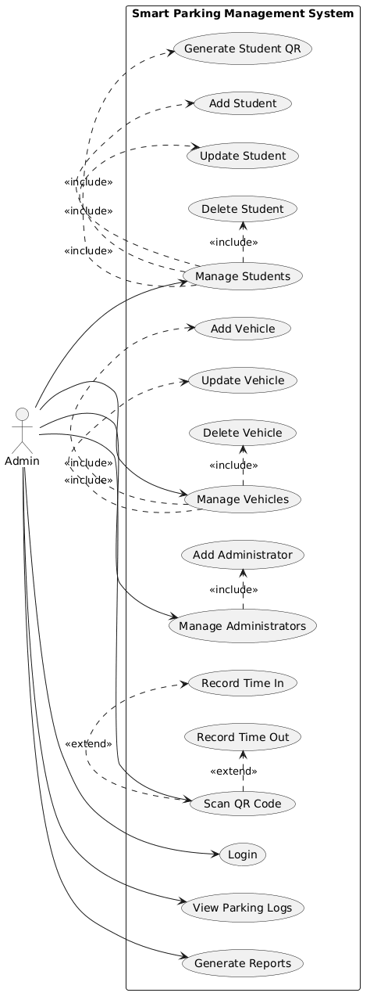

#  Student Vehicle Parking Management System

A **JavaFX desktop application** designed to automate campus vehicle entry and exit using **QR Code authentication**. The system allows administrators to manage students, vehicles, parking logs, and reports while providing a QR Scanner Kiosk that uses a laptop webcam to verify student QR codes.

Built using **JavaFX**, **MySQL**, **JDBC**, and follows the **Model-View-Controller (MVC)** architectural pattern.

---

#  Features

## Administrator

- Secure Administrator Login (SHA-256 password authentication)
- Dashboard with real-time statistics
- Student Management (Add, Update, Delete, Search)
- Vehicle Management
- Parking Log Management
- Daily, Weekly, and Monthly Reports
- Upload Student Photos
- Generate QR Codes
- QR Code Preview
- Save QR Code (Save As...)
- Export Reports to PDF
- Export Reports to Excel

---

## Scanner Kiosk

- Automatic Webcam Initialization
- Live Camera Preview
- QR Code Detection using Laptop Webcam
- Student Verification
- Vehicle Verification
- Automatic Entry Recording
- Automatic Exit Recording
- Gate Simulation
- Automatic Reset after Successful Scan

---

# Tech Stack

- Java 17
- JavaFX 21
- Maven
- MySQL
- JDBC (MySQL Connector/J)
- ZXing (QR Code Generation & Decoding)
- Webcam Capture API (sarxos)
- Apache PDFBox
- Apache POI

---

# Project Structure

```
StudentParkingSystem
│
├── pom.xml
├── sql/
│   └── schema.sql
│
└── src/
    └── main/
        ├── java/
        │   └── com.parking/
        │       ├── controller/
        │       ├── model/
        │       ├── service/
        │       ├── database/
        │       ├── util/
        │       └── Main.java
        │
        └── resources/
            ├── css/
            ├── photos/
            ├── qrcodes/
            ├── exports/
            └── view/
```

---

# Database Setup

Start your MySQL server.

Execute the schema:

```bash
mysql -u root -p < sql/schema.sql
```

This will create:

- parking_system database
- administrator table
- student table
- vehicle table
- parking_log table
- sample student
- sample vehicle
- default administrator account

---

# Default Administrator Account

Username

```
admin
```

Password

```
123456
```

---

# Configure Database Connection

Open

```
src/main/java/com/parking/database/DBConnection.java
```

Update:

```java
private static final String USER = "root";
private static final String PASSWORD = "";
```

Replace the password with your MySQL password.

---

# Running the Project

Using Maven:

```bash
mvn clean javafx:run
```

Or run the project directly from IntelliJ IDEA.

The required libraries will automatically be downloaded from Maven Central.

---

# Administrator Workflow

```
Administrator Login
        │
        ▼
Dashboard
        │
        ├── Manage Students
        ├── Manage Vehicles
        ├── Parking Logs
        ├── Reports
        └── Scanner Kiosk
```

---

# Student Management Workflow

```
Add Student
      │
      ▼
Upload Photo
      │
      ▼
Generate QR Code
      │
      ▼
QR Saved
      │
      ▼
QR Preview
      │
      ├── Save As...
      └── Close
```

Generated QR Codes are stored in:

```
src/main/resources/qrcodes/
```

Each QR Code stores the Student ID.

Example:

```
2023-00123
```

---

#  Scanner Kiosk Workflow

When the Scanner Kiosk opens:

```
Open Scanner
      │
      ▼
Laptop Webcam Starts
      │
      ▼
Live Camera Preview
      │
      ▼
Detect QR Code
      │
      ▼
Verify Student
      │
      ▼
Verify Registered Vehicle
      │
      ▼
Check Active Parking Log
      │
      ▼
ENTRY or EXIT Recorded
      │
      ▼
Gate Opens
      │
      ▼
System Resets
```

---

#  Reports

The system supports:

- Daily Reports
- Weekly Reports
- Monthly Reports

Export Formats:

- PDF
- Excel (.xlsx)

Reports are saved inside:

```
src/main/resources/exports/
```

---

# QR Code System

Each student is assigned a unique QR Code.

The administrator can:

- Generate QR Code
- Preview QR Code
- Save As... (Copy QR anywhere)
- Reprint the QR Code anytime if the student loses it

The QR Code always contains the Student ID, allowing quick identification at the Scanner Kiosk.

---

# Security

- SHA-256 password hashing
- Prepared Statements
- JDBC parameterized queries
- MVC Architecture
- MySQL Foreign Key Constraints

---

# User Session Management (Java Serialization)

The system implements **Java Serialization** to manage administrator sessions.

After a successful login, the authenticated `Administrator` object is serialized and stored in:

```
session.dat
```

The serialized file maintains the administrator's session while navigating through different modules of the system.

Upon logout:

- The administrator session is cleared.
- The `session.dat` file is automatically deleted.
- The user is redirected back to the Login screen.

Java Serialization is implemented using Java's `ObjectOutputStream` and `ObjectInputStream` within the `Session` service class.

---

# SOLID Design Principles Applied

## 1. Single Responsibility Principle (SRP)

### Classes

- AuthenticationService
- ParkingService
- QRService
- CameraService
- Session

### Description

Each class is responsible for only one specific task.

- `AuthenticationService` handles administrator authentication.
- `ParkingService` manages parking operations.
- `QRService` generates QR Codes.
- `CameraService` handles webcam initialization and QR scanning.
- `Session` manages administrator sessions using Java Serialization.

### Benefit

Separating responsibilities makes the application easier to maintain, debug, test, and extend.

---

## 2. Liskov Substitution Principle (LSP)

### Classes

- User
- Administrator

### Description

The `Administrator` class extends the abstract `User` class by implementing the `login()` and `logout()` methods. Because of this, an `Administrator` object can be substituted wherever a `User` object is expected without affecting the application's behavior.

### Benefit

This promotes code reuse and allows future user types to be added without modifying existing code.

---

# Design Patterns Applied

## Creational Design Pattern

### Singleton Pattern

**Class**

- DBConnection

### Description

The `DBConnection` class maintains a single shared database connection. Before creating a new connection, it checks whether an existing one is already available and reuses it when possible.

### Benefit

- Prevents unnecessary database connections.
- Centralizes database access.
- Improves resource management.

---

## Structural Design Pattern

### Model-View-Controller (MVC)

### Components

- Model
- View
- Controller

### Description

The application follows the Model-View-Controller (MVC) architectural pattern.

- **Model** contains application data such as `Student`, `Vehicle`, `Administrator`, and `ParkingLog`.
- **View** contains the JavaFX FXML user interfaces.
- **Controller** processes user interaction and communicates with the service layer.

### Benefit

Separates the user interface from business logic, making the application easier to maintain, organize, and extend.

---

## Behavioral Design Pattern

### Template Method Pattern

### Classes

- User
- Administrator

### Description

The abstract `User` class defines the authentication operations through the abstract methods `login()` and `logout()`, while the `Administrator` class provides their concrete implementations.

### Benefit

Promotes code reuse through inheritance, ensures a consistent authentication process, and simplifies the addition of future user roles.

# UML Diagrams

## Use Case Diagram



## Class Diagram


## Sequence Diagram


## Activity Diagram


#  Developed By

**John Emmanuel B. Montemayor**

Bachelor of Science in Information Technology (BSIT)

Cebu Institute of Technology – University (CIT-U)

---

## License

This project was developed for academic purposes.
